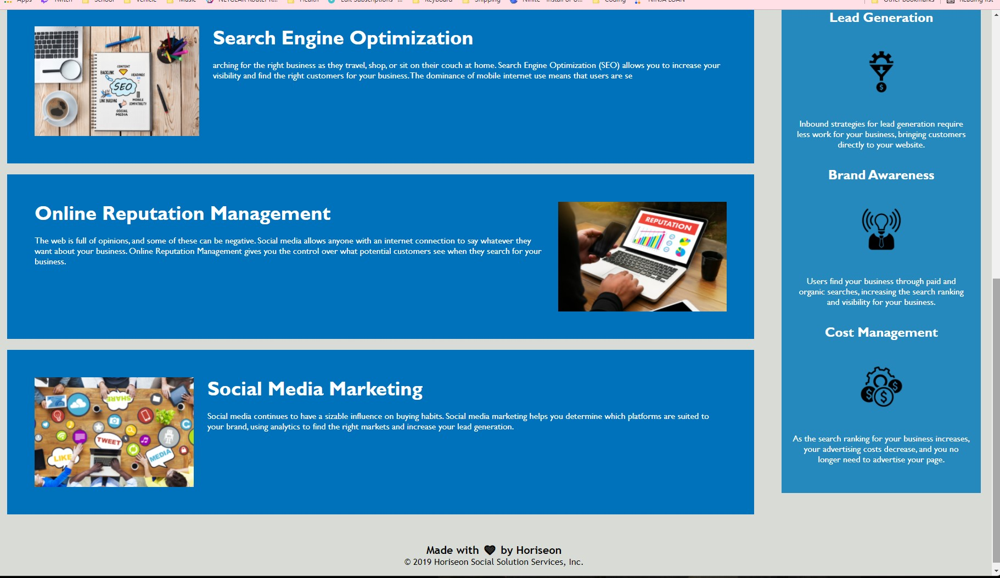

# Refactoring Client Site 

The assigned task is to simplify the clients website code and to make it more accessible, such as adding alt tags to images, adding semantic HTML elements, and removing extraneous code. 

* 
* 

## Built With

* [HTML](https://developer.mozilla.org/en-US/docs/Web/HTML)
* [CSS](https://developer.mozilla.org/en-US/docs/Web/CSS)

## Deployed Link

* [See Live Site](https://dazedchou.github.io/refactoring-client-site/)

## Authors

* **David Chou** 

- [Link to Github](https://github.com/DazedChou)
- [Link to LinkedIn](https://www.linkedin.com/in/davidchou99/)

## License

This project is licensed under the MIT License 

